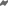
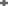
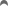
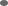
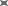
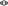
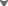
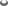
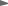

# Aggressive Usability Hats

In this set, I went almost all-out on usability (coarse features, big blobs of foreground area).
I allowed the hats to become much uglier and farther from the spirit of the original hat, while still resembling the original name.

These hats have very simple path definitions, so they are easy to tweak by hand in a text editor rather than requiring a svg editing app.
The `*_scratch.svg` files are the same as the non-scratch files, but have human friendly formatting over several lines.

## hats

Dimensions are formatted `{Width}x{Height}`.

Individual hats are presented as: 200x150, 13x10, 8x6.

### all hats

bolt, crosshairs, curve, default, ex, eye, fox, frame, hole, play, wing, chip

    13x10:
    
    
    
    
    
    
    
    
    
    
    
    

    8x6:
    
    
    
    
    
    
    
    
    
    
    
    

### bolt

### crosshairs

### curve

### default

### ex

### eye

### fox

### frame

### hole

### play

### wing

### chip (not an official hat)

