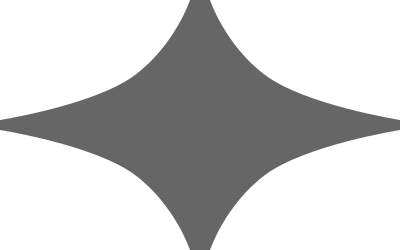
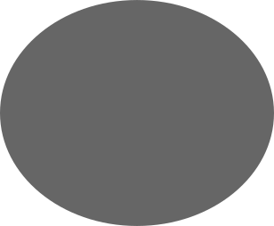
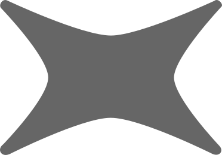
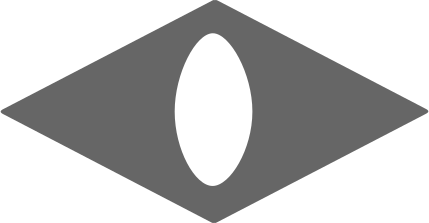
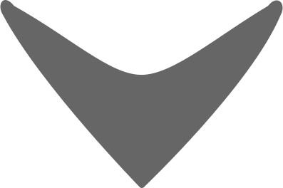
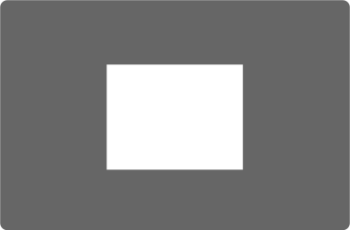
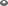
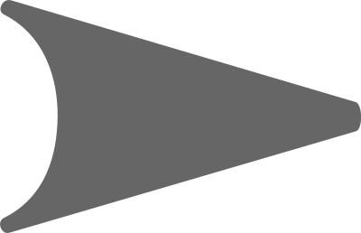

# Proposed Compromise Hats

From my [thicker hats PR](https://github.com/cursorless-dev/cursorless/pull/1809).
Tried to increase usability while not sacrificing prettiness very much.
Also tried to keep very similar to the original spirit of that, except for hole.

## hats

Individual hats are presented as: 200w 150h, 13w 10h, 8w 6h.

Hat sequences are presented in: 13w 10h, 8w 6h.

### all hats

bolt, chip, crosshairs, curve, default, ex, eye, fox, frame, hole, play, wing

    
    
    
    
    
    
    
    
    
    
    
    

    
    
    
    
    
    
    
    
    
    
    
    

### bolt

### crosshairs

### curve

### default

### ex

### eye

### fox

### frame

### hole

### play

### wing

